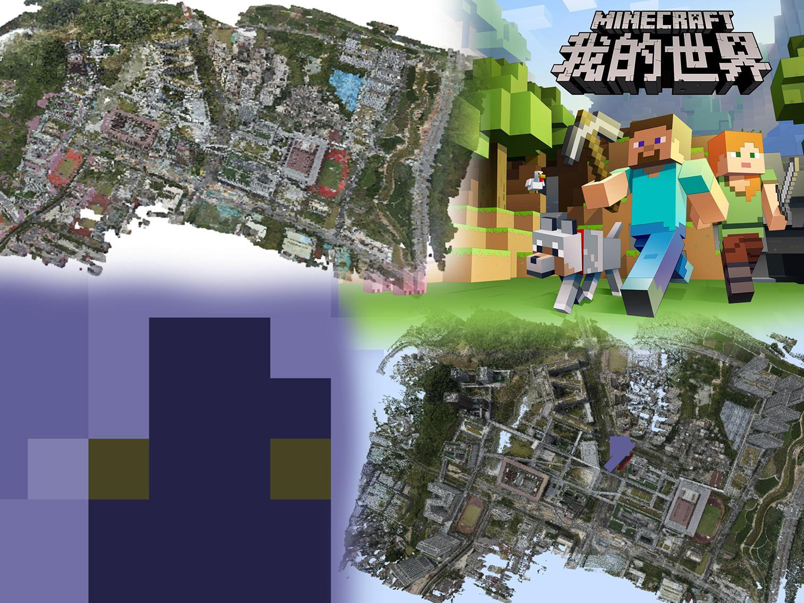

<h1>
  

    
     
    DJZT_To_Minecraft
  

</h1>

## 简介

这是一个针对大型场景（百米级）的3d建模（.pcd）文件转换为我的世界函数文件（.mcfunction）的程序

## 安装

* 要求 [Windows>=10]()操作系统，[Python>=3.6](https://www.python.org/)和 [git](https://git-scm.com/) 和 [Minecraft 1.18.2]()
* 新建文件夹并在该目录下打开命令行，并运行 `git clone https://github.com/Mick4994/djzt_to_Minecraft.git`
* 在命令行运行 `pip install requirements.txt -r` 安装依赖库，国内用户在这条命令后加上`-i https://pypi.tuna.tsinghua.edu.cn/simple`
* 将pcd文件放入 `./3D-models/terra_pcd/` 目录中，并将主目录下的 `colors_mod-1.1.0.jar`放入
* 安装完成时，运行 `python main-nogui.py`

## 运行

* 加载pcd文件：提示`loading pcd`，这通常需要几十秒不等的时间，当提示`finish save numpy data`
* 生成材质包：在主目录下生成`resource_pack`文件夹，压缩为 `.zip` 文件后即为Minecraft材质包文件
* 转化模型数据：该步骤等待时间较长，请耐心等待，控制台有进度提示
* 生成数据包：在主目录下生成`setblock`文件夹，之后需手动放入Minecraft数据包文件所放目录
* 等待控制台的日志记录提示 `finish all work!` 时运行完成

注：每个步骤会开始前会对上个步骤的数据进行缓存，缓存文件为`.npy`格式的文件，未运行完成时请勿删除

## 开发

#### 版本规划

* V1（当前已完成）（无gui版本且未封包）:
1. 分离了数据区和程序区并对象化
2. 添加控制台进度条和日志库记录
3. 多线程处理任务量大的转化工作

    * V2（未来）（开发gui版本，提高傻瓜化程度) ：
    1. 开发gui，界面美化
    2. 兼容更多模型文件？
    3. 兼容更多Minecraft版本？
    4. 加入小方块mod进一步提高导入到Minecraft中的尺寸精度
    5. 重新开发Minecraft mod，扩大色彩空间

#### 开发准备

要求：
1. 具备Python，Java程序开发能力
2. 对Minecraft运行机制有一定了解
3. 有建模软件基础

注：以上条件有一个即可，多多益善

* 在完成安装的基础上，使用集成开发环境或编辑器，如Pycharm，vscode等，打开工作区`djzt_to_Minecraft`.
* 搭建 Minecraft Fabric 开发环境，过程冗杂，详细教程请观看：[Re：从零开始的模组编程-ep-1 无聊到极点但一劳永逸的环境搭建](https://www.bilibili.com/video/BV11a411a7uT/)
* 可以打开pcd或obj建模的软件，如Windows自带的3D查看器或blender(用于打开obj文件)。
* 有意可联系第一作者，QQ：1140239446